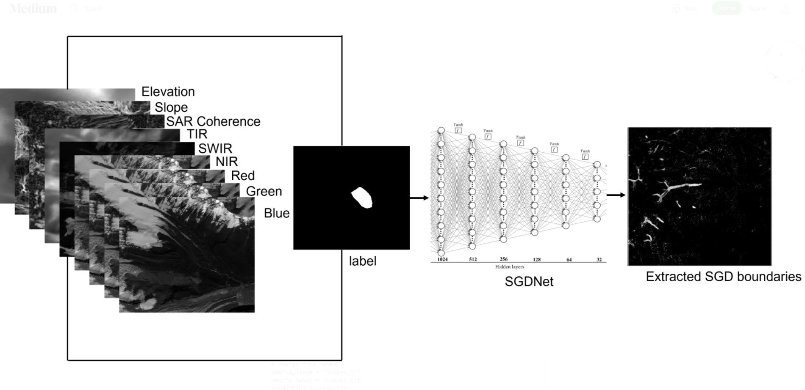

This blog provides a step-by-step implementation of deep learning using multisource remote sensing data for extracting glacier boundaries (specifically supraglacial debris, which is referred to as glacier boundary throughout the post, as mapping of clean ice is quite straightforward using NDSI) in parts of the Himalaya-Karakoram (HK). This blog is equally relevant to all GeoAI enthusiasts who are interested in Earth Observation (EO) applications using deep learning. The code and explanation provided here are easy to adapt for other EO applications. The original data and code of this work can be accessed via [Repository Link]([ADD_YOUR_REPO_LINK_HERE](https://github.com/Sk-2103/Automated-mapping-of-debris-covered-glaciers-using-deep-learning-and-multisource-remote-sensing-data.git)).

<figure style="text-align: center;">
    
    <figcaption style="font-size: 14px; color: gray;">
        Figure: Example of deep learning-based glacier mapping using multisource remote sensing data.
    </figcaption>
</figure>
