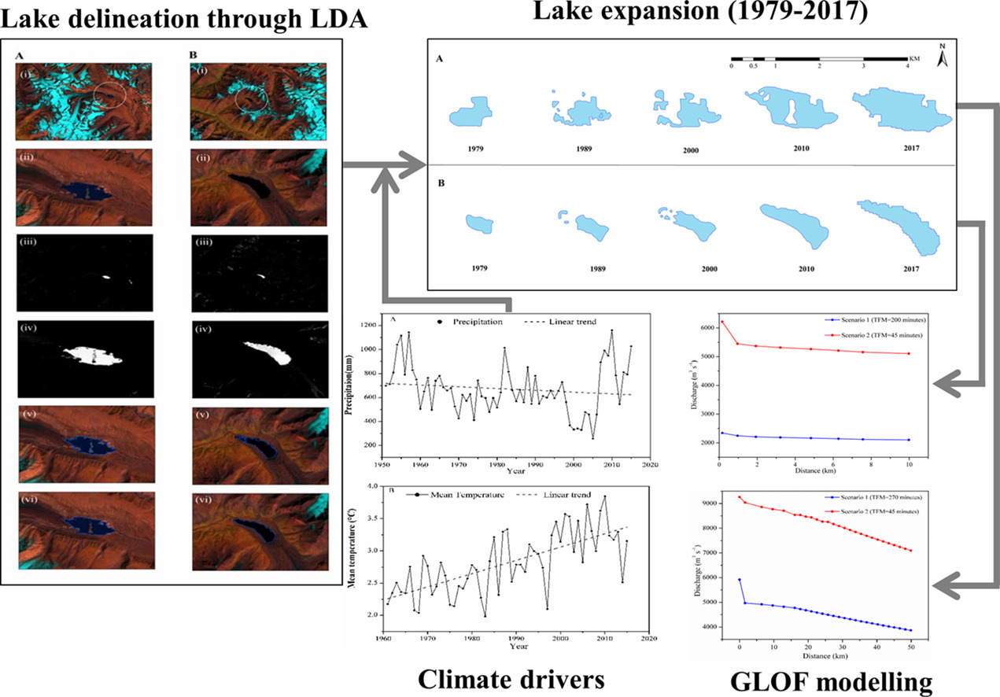

<figure style="text-align: center;">
    
    <figcaption style="font-size: 14px; color: gray;">
        Figure: The study reports applicability of Lake Detection Algorithm (LDA), glacial lake expansion in warming climate and GLOF modelling in parts of Western Himalaya.
    </figcaption>
</figure>

  <h3>Abstract</h3>
  
The presented study reports applicability of Lake Detection Algorithm (LDA) for an automated extraction of glacial lakes over a large geographical region and dynamics of Samudra Tapu and Gepang Gath glacial lakes. The areal extent of lake boundary extracted through LDA and areal extent of manually interpreted lake boundary exhibit a remarkable agreement (R2~0.99). Glacial lake dynamics is assessed in terms of areal and volumetric expansion for two selected glacial lakes from 1979 to 2017, i.e. Samudra Tapu (0.95 km2), and Gepang Gath (0.67 km2). They show volumetric expansion from 8.52 × 106 m3 (1979) to 80.34 × 106 m3 (2017) and 2.04 × 106 m3 (1979) to 32.44 × 106 m3 (2017) respectively. Statistical analysis (Mann-Kendall and Sen's slope) of climate data indicates rise in mean annual temperature (0.021 °C yr−1; 1961–2015) and fall in annual precipitation (−2.74 mm yr−1; 1951–2015) at different confidence intervals. Further Glacial Lake Outburst Flood (GLOF) is modelled using empirical relationship and Simplified Dam Breach Model (SMPDBK). The SMPDBK demonstrates discharge of 3866.52 and 2100.90 m3 s−1 reaching Chhatru and Sissu village posing threat to life and property. The study also exhibits that glacial shrinkage under the influence of climate change causes expansion of glacial lakes. This expansion is expected to intensify catastrophic GLOF and resultant fatalities and destruction in the downstream region.

