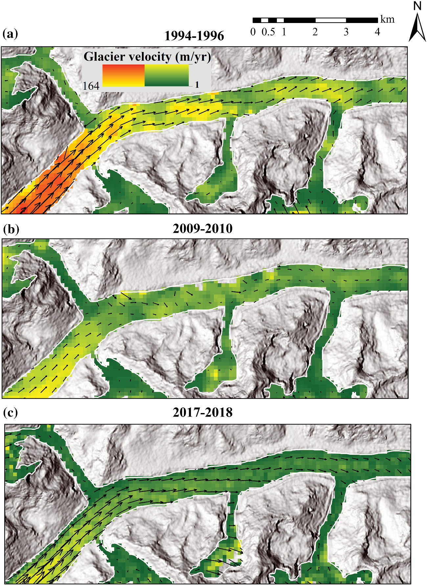

<figure style="text-align: center;">
    
    <figcaption style="font-size: 14px; color: gray;">
        Figure: Temporal snapshot of Zemu glacial slowndown situtated in Sikkim Himalaya. 
    </figcaption>
</figure>

  <h3>Abstract</h3>
  
Investigation of spatiotemporal variation in glacier velocity is imperative to comprehend glacier mass and volume loss as a function of their sensitivity to climate change. The long-term glacier velocity record for the Eastern Himalayan region is of utmost importance owing to its data scarcity and climate sensitivity. Here, we present a long-term dataset spanning more than two decades (1994–2020) of glacier surface velocity for the entire Sikkim Himalaya by applying image correlation methods on the multi-temporal Landsat images. Our results demonstrate an average glacier surface velocity decline from 15.7 ± 5.69 (1994/96) to 12.88 ± 2.09 m yr−1 (2018/2020), that is a decline of ~15% during the period of investigation. Trend analysis shows a decreasing trend in median velocity (32.2%) at a rate of 0.25 m yr−1. Despite the general decline in average glacier velocity, the rate of slowdown of individual glaciers is extremely heterogeneous (3.6–20 m yr−1). Our study shows that up to 32% of the observed heterogeneity in velocity variation can be explained by the variation in glacier size. The present study highlights that large glaciers with thick ice cover move faster compared to small glaciers (even those situated on steep slopes). The findings are significant and have direct implications for assessing future water availability scenarios and modelling glacio-hydrology in the region.

