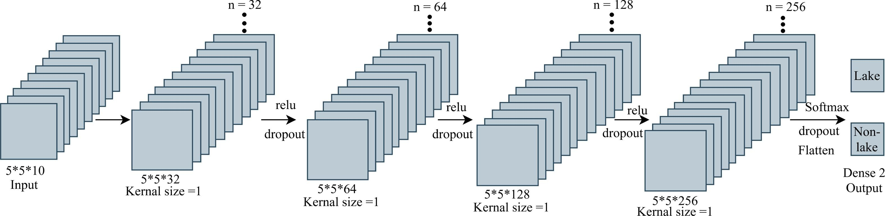
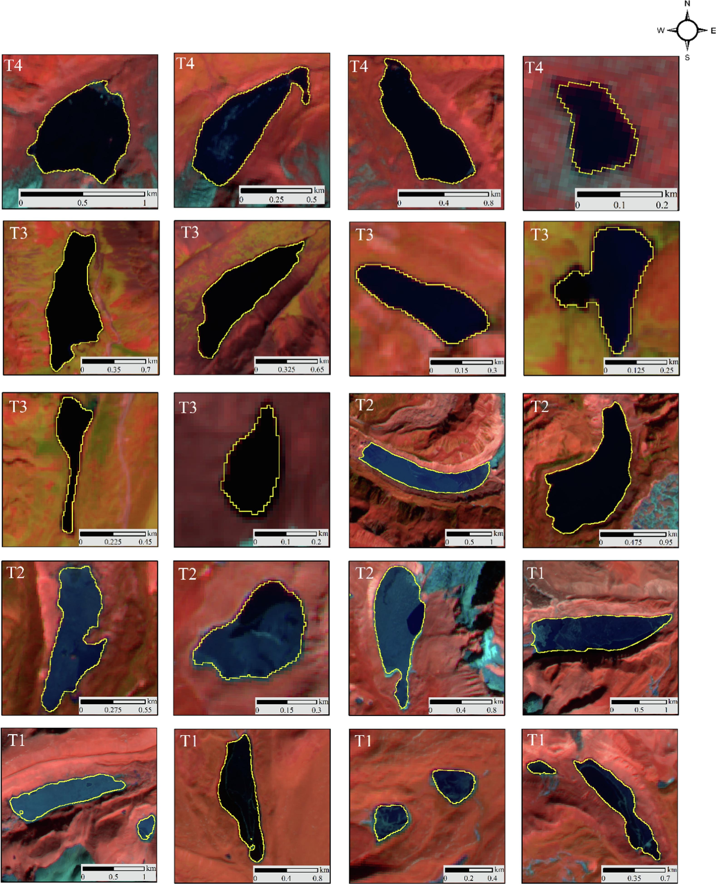

    <figure style="text-align: center;">
        
        <figcaption style="font-size: 14px; color: gray;"> Proposed light-weight DL model (GLNet) for glacial lake mapping. 
 <figure style="text-align: center;">
    
    <figcaption style="font-size: 14px; color: gray;"> Example of precise glacial lake mapping using GLNet
   

