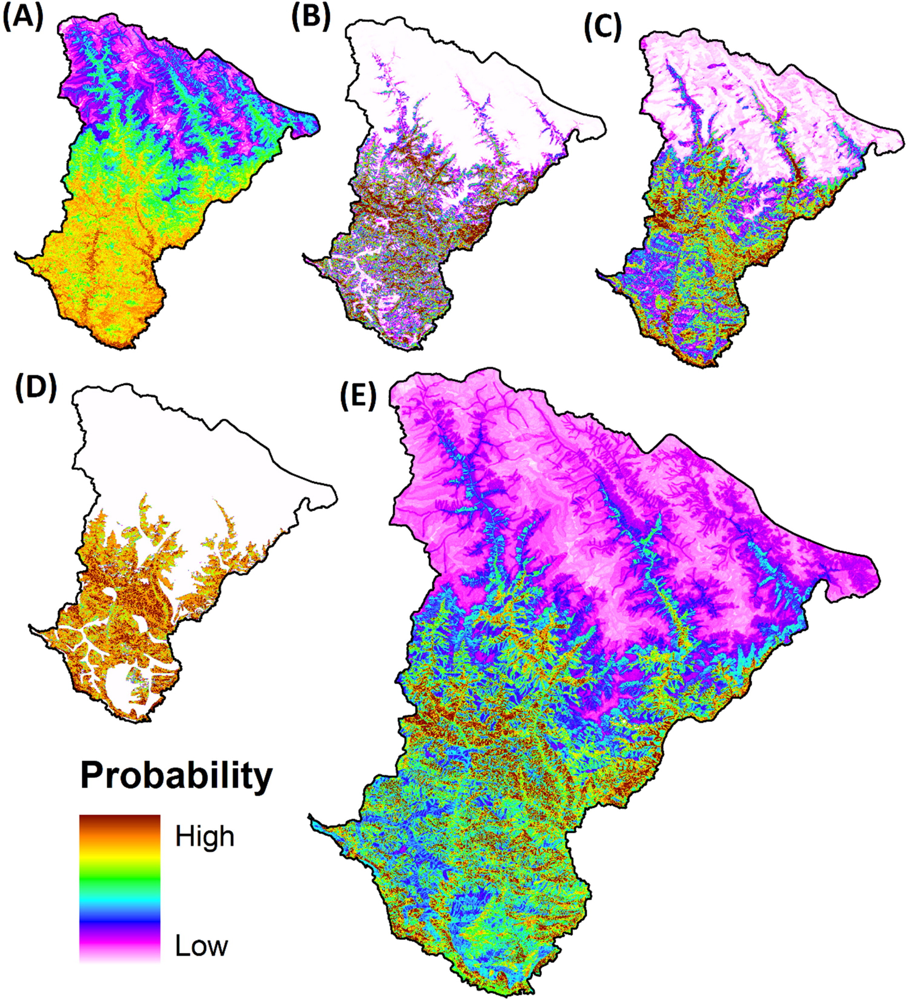

<figure style="text-align: center;">
    
    <figcaption style="font-size: 14px; color: gray;">
        Figure: Landslide susceptibility assessment at the landscape level using multivariate analysis coupled with statistical algorithms – An insight from India’s Kailash Sacred Landscape, Western Himalaya.
    </figcaption>
</figure>
