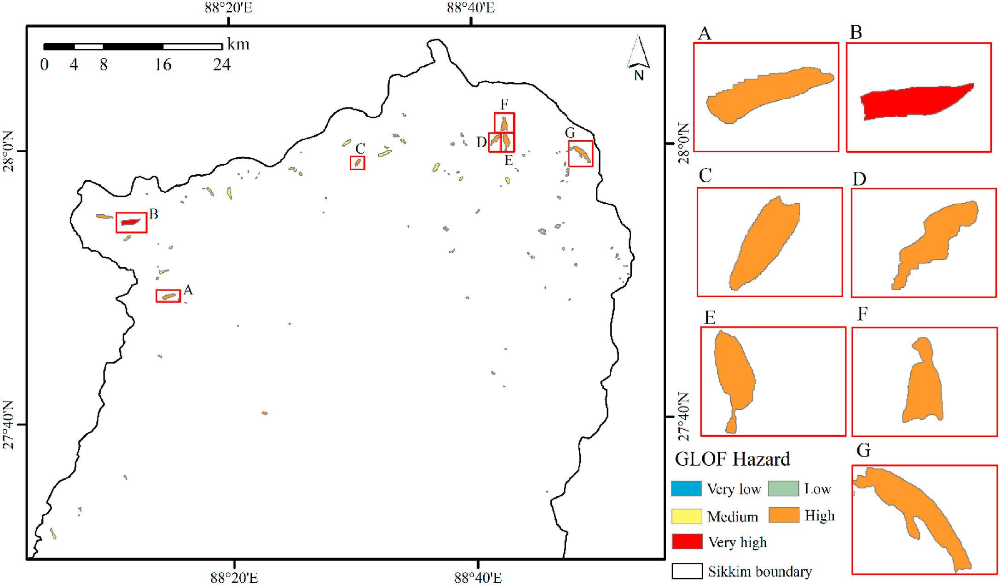

<figure style="text-align: center;">
    
    <figcaption style="font-size: 14px; color: gray;">
        Figure: Identification of potentially dangerous glacial lakes in Sikkim Himalaya.
    </figcaption>
</figure>
