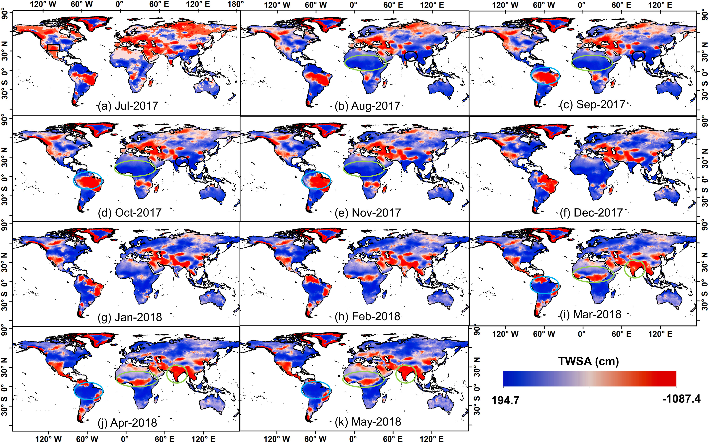

<figure style="text-align: center;">
    
    <figcaption style="font-size: 14px; color: gray;">
        Figure: Monthly multi-model Leader predictions of TWSA during the GRACE and GRACE-FO data gap (July 2017 to May 2018). Black boxes and circles highlight extreme events (drought and flood), while light green and light blue circles indicate strong seasonal variations in predicted TWSA.
    </figcaption>
</figure>

  <h3>Abstract</h3>
  
The Gravity Recovery and Climate Experiment (GRACE) and GRACE Follow-On (GFO) missions have provided valuable data for monitoring global terrestrial water storage anomalies (TWSA) over the past two decades. However, the nearly one-year gap between these missions pose challenges for long-term TWSA measurements and various applications. Unlike previous studies, we use a combination of Machine Learning (ML) methods—Random Forest (RF), Support Vector Machine (SVM), eXtreme Gradient Boosting (XGB), Deep Neural Network (DNN), and Stacked Long-Short Term Memory (SLSTM)—to identify and efficiently bridge the gap between GRACE and GFO by using the best-performing ML model to estimate TWSA at each grid cell. The models were trained using six hydroclimatic variables (temperature, precipitation, runoff, evapotranspiration, ERA5-Land derived TWSA, and cumulative water storage change), as well as a vegetation index and timing variables, to reconstruct global land TWSA at 0.5° grid resolution. We evaluated the performance of each model using Nash-Sutcliffe Efficiency (NSE), Pearson's Correlation Coefficient (PCC), and Root Mean Square Error (RMSE). Our results demonstrate test accuracy with area weighted average NSE, PCC, and RMSE of 0.51 ± 0.31, 0.71 ± 0.23, and 4.75 ± 3.63 cm, respectively. The model's performance was further compared across five climatic zones, with two previously reconstructed products (Li and Humphrey methods) at 26 major river basins, during flood/drought events, and for sea-level rise. Our results showcase the model's superior performance and its capability to accurately predict data gaps at both grid and basin scales globally.

