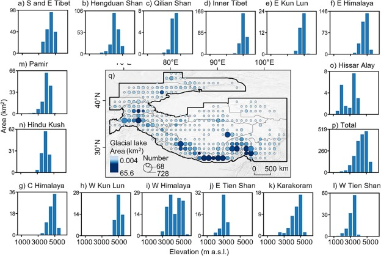

<figure style="text-align: center;">
    
    <figcaption style="font-size: 14px; color: gray;">
        Figure: Glacial lakes in the TPR in 2020. a–p) The elevation distribution of glacial lakes for various sub-regions and the entire TPR, q) the distribution of glacial lake number and area (km2) on a 1o × 1o grid, where the circle sizes represent number, and the colors are area.
    </figcaption>
</figure>
