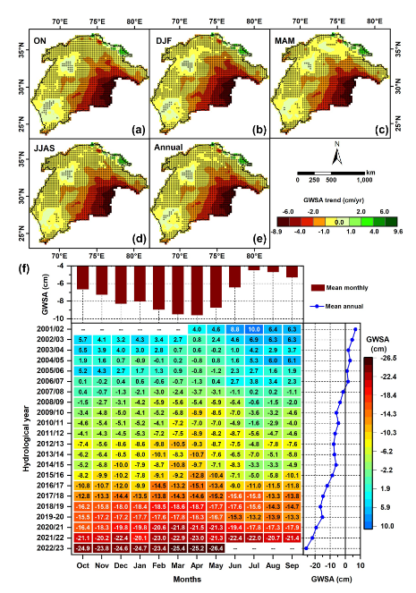

<figure style="text-align: center;">
    
    <figcaption style="font-size: 14px; color: gray;">
        Figure: Spatial distribution of GWSA trends at seasonal scales (a–d) and annually (e), with significance levels at p < 0.05. (f) Shows the heatmap of monthly GWSA values and their corresponding mean monthly and annual values from April 2002 to May 2023.
    </figcaption>
</figure>
