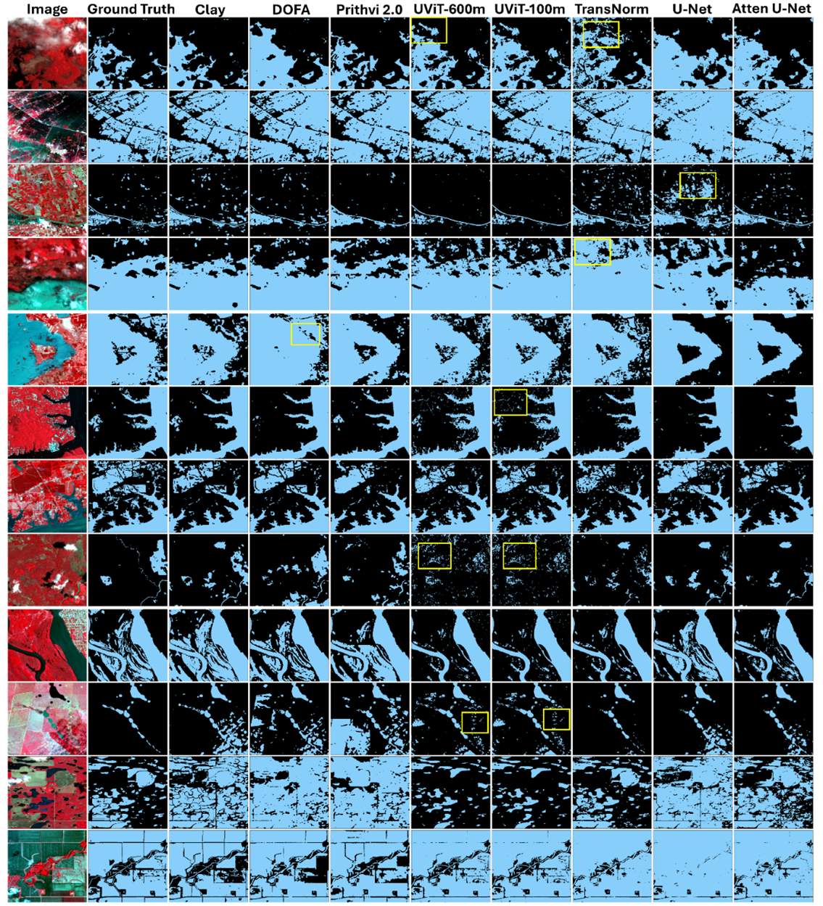
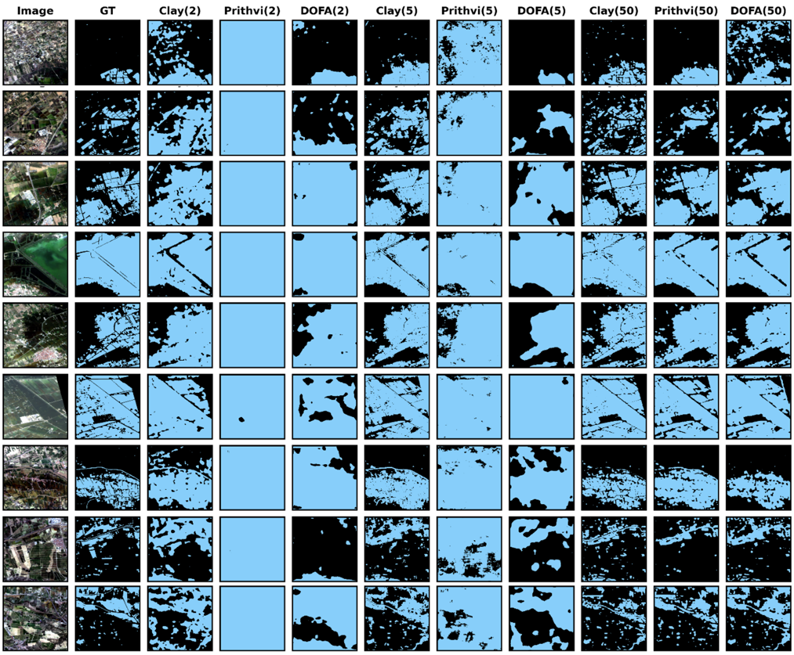

<figure style="text-align: center;">
    
    <figcaption style="font-size: 14px; color: gray;">
        Figure: A visual analysis of model performance showing Clay, Prithvi, DOFA GFMs outperform traditional CNN models and vision transformers (TransNorm). Yellow boxes show examples of false positive classification by models.
    </figcaption>
</figure>
<figure style="text-align: center;">
    
    <figcaption style="font-size: 14px; color: gray;">
        Figure: Few-shot experiment with Clay, DOFA and Prithvi Geo-Foundational Model. number in Parenthesis shows number of images used for training.
    </figcaption>
</figure>
