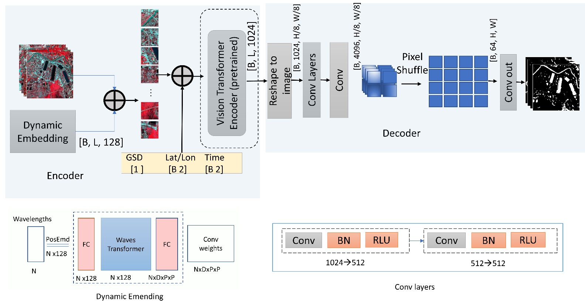

<figure style="text-align: center;">
    
    <figcaption style="font-size: 14px; color: gray;">
        Figure: A visual analysis of model performance showing Clay, Prithvi, DOFA GFMs outperform traditional CNN models and vision transformers (TransNorm). Yellow boxes show examples of false positive classification by models.
    </figcaption>
</figure>
<figure style="text-align: center;">
    
    <figcaption style="font-size: 14px; color: gray;">
        Figure: Fine-tuning Clay Geo-Foundation Model for flood inundation mapping.
    </figcaption>
</figure>

  <h3>Abstract</h3>
  
Geo-Foundational Models (GFMs) enable fast and reliable extraction of spatiotemporal information from satellite imagery, improving flood inundation mapping by leveraging location and time embeddings. Despite their potential, it remains unclear whether GFMs outperform traditional models like U-Net. A systematic comparison across sensors and data availability scenarios is still lacking, which is an essential step to guide end-users in model selection. To address this, we evaluate three GFMs, Prithvi 2.0, Clay V1.5, DOFA, and UViT (a Prithvi variant), against TransNorm, U-Net, and Attention U-Net using PlanetScope, Sentinel-1, and Sentinel-2. We observe competitive performance among all GFMs, with only 2-5% variation between the best and worst models across sensors. Clay outperforms others on PlanetScope (0.79 mIoU) and Sentinel-2 (0.70), while Prithvi leads on Sentinel-1 (0.57). In leave-one-region-out cross-validation across five regions, Clay shows slightly better performance across all sensors (mIoU: 0.72(0.04), 0.66(0.07), 0.51(0.08)) compared to Prithvi (0.70(0.05), 0.64(0.09), 0.49(0.13)) and DOFA (0.67(0.07), 0.64(0.04), 0.49(0.09)) for PlanetScope, Sentinel-2, and Sentinel-1, respectively. Across all 19 sites, leave-one-region-out cross-validation reveals a 4% improvement by Clay compared to U-Net. Visual inspection highlights Clay's superior ability to retain fine details. Few-shot experiments show Clay achieves 0.64 mIoU on PlanetScope with just five training images, outperforming Prithvi (0.24) and DOFA (0.35). In terms of computational time, Clay is a better choice due to its smaller model size (26M parameters), making it ~3x faster than Prithvi (650M) and 2x faster than DOFA (410M). Contrary to previous findings, our results suggest GFMs offer small to moderate improvements in flood mapping accuracy at lower computational cost and labeling effort compared to traditional U-Net.

