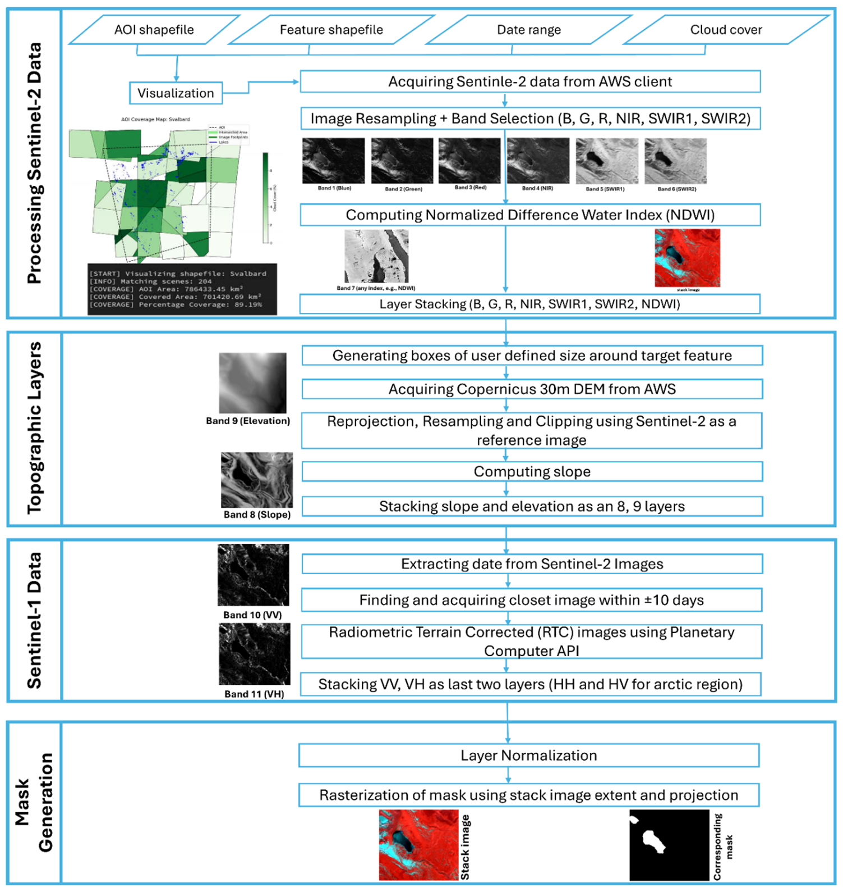
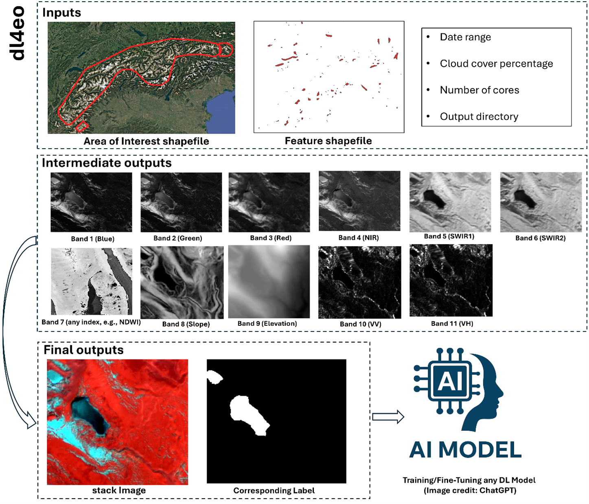
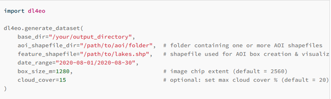

<figure style="text-align: center;">
    
    <figcaption style="font-size: 14px; color: gray;">
        Figure: Overall workflow of DL4EO package which can be subdivided into four major parts 1) acquiring and processing Sentinel-2, 2) acquiring and processing topographic layers, 3) acquiring and processing Seitnel-1 data and 4) Mask/label generation and image normalization.
    </figcaption>
<figure style="text-align: center;">
    
    <figcaption style="font-size: 14px; color: gray;">
        Figure: Example of DL4EO usage case of generating multi-source remote sensing for glacial lake segmentation in central Europe.
    </figcaption>
</figure>
<figure style="text-align: center;">
    
    <figcaption style="font-size: 14px; color: gray;">
        Figure: Python code for generating training and validation dataset for any Earth Observation segmentation task.
    </figcaption>
</figure>

