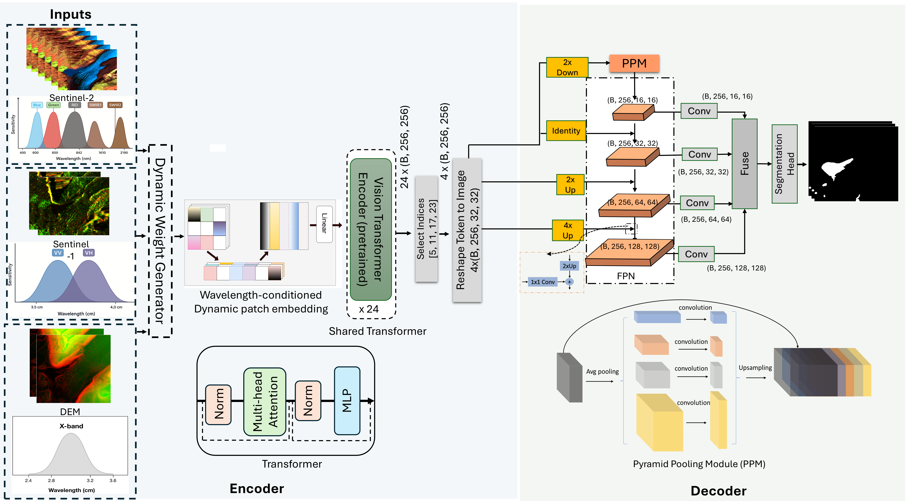
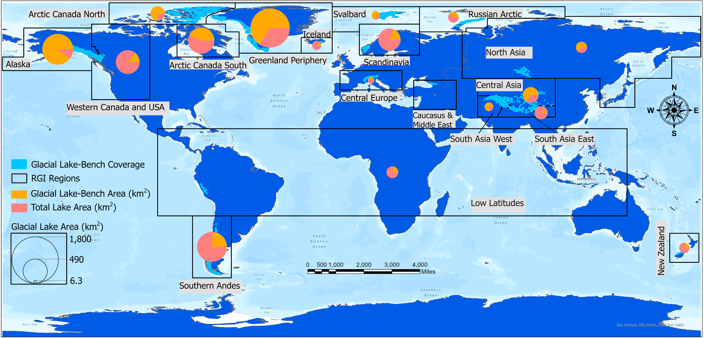
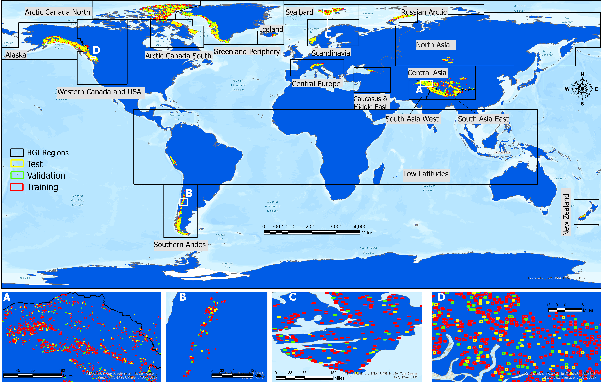

<figure style="text-align: center;">
    
    <figcaption style="font-size: 14px; color: gray;">
        Figure: Schematic illustration of fine-tuning DOFA geo-foundational model for glacial lake mapping using Glacial Lake Bench dataset.
    </figcaption>
<figure style="text-align: center;">
    
    <figcaption style="font-size: 14px; color: gray;">
        Figure: Compilation of Glacial Lake-Bench collected globally across each RGI region. GLB consist of Sentinel-1 (VV and VH), Sentinel-2 (Blue, Green, Red, NIR, SWIR-11, SWIR-12, NDWI), Topographic layers (Slope and Elevation). The map shows ratio between total lake area reported by (Zhang et al., 2024) and lake area covered by Glacial Lake-Bench
    </figcaption>
</figure>
<figure style="text-align: center;">
    
    <figcaption style="font-size: 14px; color: gray;">
        Figure: Spatial distribution of training, testing and validation sites across globe.
    </figcaption>
</figure>
<figure style="text-align: center;">
    
    <figcaption style="font-size: 14px; color: gray;">
        Figure: Example of successful implementation of DOFA, trained on the Glacial Lake-Bench dataset, for mapping lakes under manually curated challenging conditions (i.e., Glacial Lake-Challenge dataset). These conditions include cloud cover, frozen lakes, shadows, and very small lake (panel e) representing a highly imbalanced class.
    </figcaption>
</figure>

