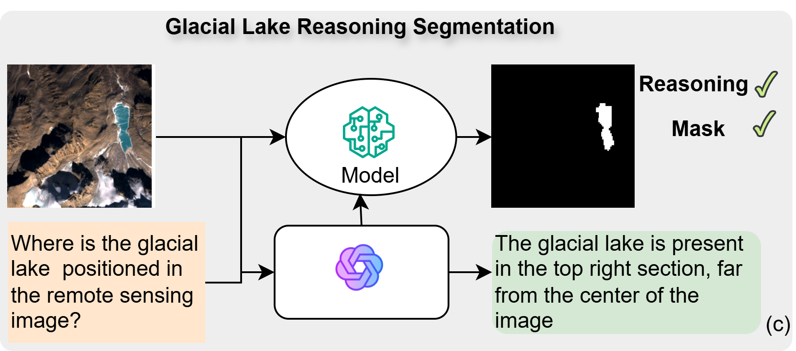
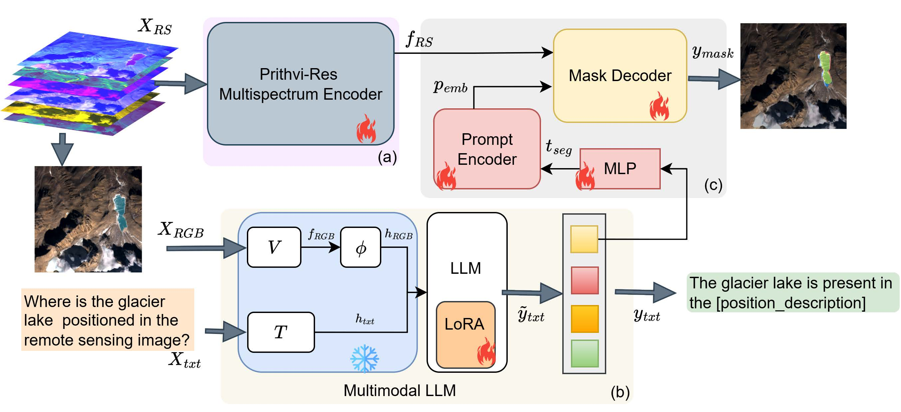

<figure style="text-align: center;">
    
    <figcaption style="font-size: 14px; color: gray;">
        Figure: Conceptual shift from traditional segmentation (a) and VQA-based reasoning (b) to our reasoning-driven paradigm (c), which unifies accurate instance-specific masks with interpretable positional reasoning.
    </figcaption>
</figure>

<figure style="text-align: center;">
    
    <figcaption style="font-size: 14px; color: gray;">
        Figure: Overview of the proposed architecture of GLACIA.
    </figcaption>
</figure>

  <h3>Abstract</h3>
  
Glacial lake monitoring bears great significance in mitigating the anticipated risk of Glacial Lake Outburst Floods. However, existing segmentation methods based on convolutional neural networks (CNNs) and Vision Transformers (ViTs), remain constrained to pixel-level predictions, lacking high-level global scene semantics and human-interpretable reasoning. To address this, we introduce GLACIA (\textbf{G}lacial \textbf{LA}ke segmentation with \textbf{C}ontextual \textbf{I}nstance \textbf{A}wareness), the first framework that integrates large language models with segmentation capabilities to produce both accurate segmentation masks and corresponding spatial reasoning outputs. We construct the Glacial Lake Position Reasoning (GLake-Pos) dataset pipeline, which provides diverse, spatially grounded question-answer pairs designed to overcome the lack of instance-aware positional reasoning data in remote sensing. Comparative evaluation demonstrate that GLACIA (mIoU: 87.30) surpasses state-of-the-art method based on CNNs (mIoU: 78.55 - 79.01), ViTs (mIoU: 69.27 - 81.75), Geo-foundation models (mIoU: 76.37 - 87.10), and reasoning based segmentation methods (mIoU: 60.12 - 75.66). Our approach enables intuitive disaster preparedness and informed policy-making in the context of rapidly changing glacial environments by facilitating natural language interaction, thereby supporting more efficient and interpretable decision-making. 

