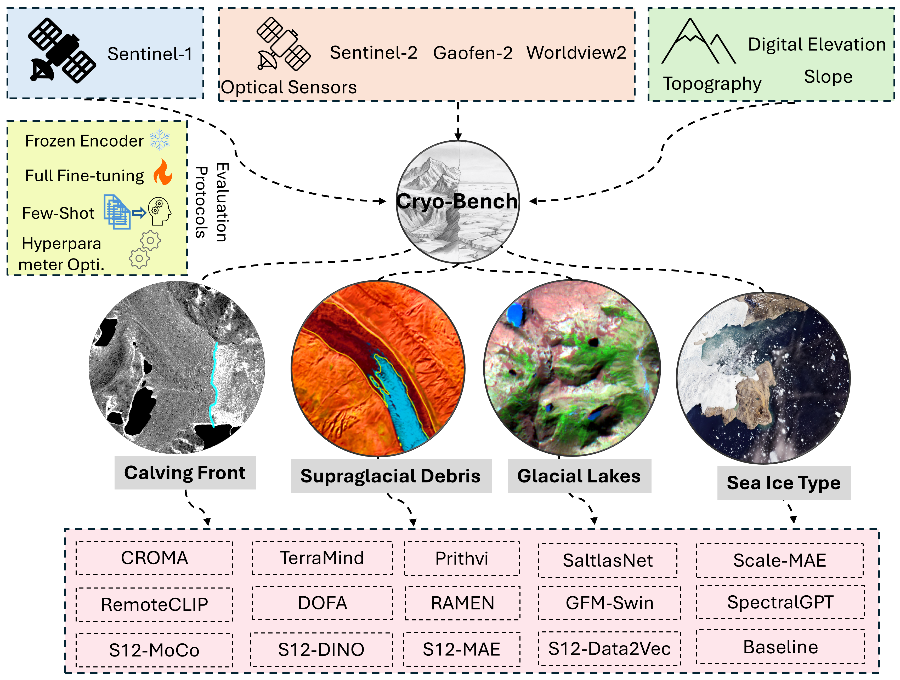

<figure style="text-align: center;">
    
    <figcaption style="font-size: 14px; color: gray;">
        Figure: A Benchmark for Evaluating Geospatial Foundation Models on Cryosphere Applications.
    </figcaption>
</figure>

  <h3>Abstract</h3>
  
Geo-Foundation Models (GFMs) have been evaluated across diverse Earth observation task including multiple domains and have demonstrated strong potential of producing reliable maps even with sparse labels. However, benchmarking GFMs for Cryosphere applications has remained limited, primarily due to the lack of suitable evaluation datasets. To address this gap, we introduce \textbf{Cryo-Bench}, a benchmark compiled to evaluate GFM performance across key Cryospheric components. Cryo-Bench includes debris-covered glaciers, glacial lakes, sea ice, and calving fronts, spanning multiple sensors and broad geographic regions. We evaluate 14 GFMs alongside UNet and ViT baselines to assess their advantages, limitations, and optimal usage strategies. With a frozen encoder, UNet achieves the highest average mIoU of \textbf{66.38}, followed by TerraMind at \textbf{64.02} across five evluation dataset included in Cryo-Bench. In the few-shot setting (10\% input data), GFMs such as DOFA and TerraMind outperform UNet, achieving mIoU scores of \textbf{59.53}, \textbf{56.62}, and \textbf{56.60}, respectively, comapred to U-Net's 56.60. When fully finetuning GFMs, we observe inconsistent performance across datasets and models. However, tuning learning rate along with finetuning substantially improves GFM performance. For example, evaluation on two representative datasets (GLID and CaFFe) shows an average relative improvement of \textbf{12.77\%}. Despite having minimal Cryosphere representation in their pretraining data, GFMs exhibit notable domain adaptation capabilities and produce meaningful results across tasks. Based on our findings, We recommend encoder fine-tuning with hyperparameter optimization optimization to achieve the best possible performance, while using frozen encoders when users need quick results without extensive experimentation. 

